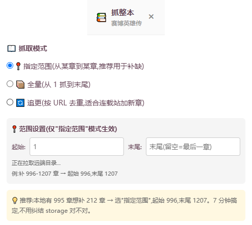
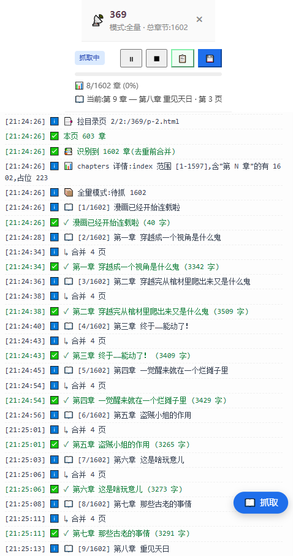

# Novel TTS Reader — Framework

> A Chrome extension that turns any novel-style website into TTS-audio you can listen to.
> Built around a **pluggable adapter architecture**: support for a new site is a single file.

[](LICENSE)
[](https://github.com/63894696/novel-tts-reader/releases/latest)
[](https://github.com/63894696/novel-tts-reader/actions/workflows/release.yml)
[](#)
[](.github/workflows/release.yml)

## ⚠️ Legal / responsible use

This repository contains a **generic content-extraction framework**. It does
**not** include adapters for any specific website and does **not** retrieve
any content on its own. To use it, you must write or supply your own
site-specific adapter (or use a separate, privately-shared build).

**Users are solely responsible for ensuring that:**

- They have legal authorization to retrieve any content via adapters they
  add to this framework.
- Their use of the extracted content complies with applicable copyright
  law and the target site's terms of service.
- They do not use this tool to facilitate copyright infringement,
  unauthorized redistribution, or commercial scraping.

The maintainers do not endorse or support use of this tool to download,
re-host, or redistribute copyrighted material without permission. Please
respect authors and support legitimate works.

## Table of contents

- [What this is](#what-this-is)
- [Screenshots](#screenshots)
- [Quick start](#quick-start-for-end-users-of-your-build)
- [Architecture](#architecture)
- [Permissions](#permissions)
- [Writing your first adapter](#writing-your-first-adapter)
- [Building a release zip](#building-a-release-zip)
- [License](#license)

## Screenshots

> The framework is site-agnostic — what you see depends on which adapter
> you ship with your build. Below is a representative example from the
> sudugu.org adapter (shipped in a separate, private build, not in this repo).
>
> See [`docs/screenshots/`](docs/screenshots/) for the full set and instructions
> on how to contribute your own.

| Floating 📖 button on a chapter page | Per-chapter panel | Grab-task monitor |
| :---: | :---: | :---: |
|  |  |  |

The third column shows the **grab-task monitor** (right side of the page)
that appears when a full-book grab is running — it shows live progress,
chapter titles being fetched, and exposes pause / resume / export controls.

## What this is

This is the **framework core** of Novel TTS Reader. It does **not** contain any
adapter targeting a specific website — it's a generic content-extraction + TTS
playback shell. To use it, you write (or copy) an adapter for the site you care
about, drop it into `extractors/`, and load the extension.

If you only want to use the extension on a specific site, ask whoever gave you
this framework for their **private build** (which contains the site adapters
they've written). This repository is for **developers and contributors** who
want to:

- Add support for a new website by writing one adapter
- Learn the architecture and fork the project
- Tweak the TTS / extraction / storage layer for their own use

## Quick start (for end users of *your* build)

1. **Load the extension**:
   - `chrome://extensions/` → enable **Developer mode**
   - Click **Load unpacked** → select this directory
2. **Visit a page on a supported site** (one for which you've written/wired an adapter)
3. Click the floating **📖 button** (bottom-right) to open the per-chapter panel
4. From the panel:
   - **▶ Listen** — play this chapter via Web Speech API
   - **📋 Copy** — copy the chapter text to clipboard
   - **💾 Download** — save as a `.txt` file
   - **📚 Grab full book** — open the configuration panel and grab the whole book

## Architecture

```
manifest.json              Extension manifest (MV3)
background.js              Thin router — zero top-level await, zero long tasks.
                           Just delegates NTTS_FETCH / NTTS_DOWNLOAD / etc.
content.js                 Main controller. Floating button, per-chapter panel,
                           grab-task loop, resume logic, full-book export.
popup.html / popup.js      TTS listener UI (click the extension icon).
lib/Readability.js         Mozilla Readability — default fallback for unknown sites.
extractors/
  _utils.js                parseHTML / resolveURL / cleanText / readJsVar / etc.
  index.js                 Adapter registry + route() + safeExtract().
  adapter-default.js       Generic Readability-based fallback (always loaded last).
  adapter-template.js      Starter template — copy this for your own adapter.
```

### Content-script load order (in `manifest.json`)

The order matters: utilities first, then site adapters (most specific first),
then the dispatcher, then the main controller.

```json
"js": [
  "lib/Readability.js",        // 1. Mozilla Readability (used by adapter-default)
  "extractors/_utils.js",      // 2. Shared helpers (parseHTML etc.)
  "extractors/adapter-default.js",   // 3. Generic fallback (registered first to global table)
  "extractors/adapter-YOURS.js",     // 4. Your adapter — must be BEFORE index.js
  "extractors/index.js",       // 5. Registry + router (last)
  "content.js"                 // 6. Main controller
]
```

## Permissions

The manifest declares `host_permissions: ["<all_urls>"]`. This is required
because the framework is **site-agnostic** — without it, the content script
cannot run on whatever website the end user's adapter targets. The framework
itself does not include any site-specific adapter, so out of the box it
behaves as a passive listener: it shows the floating 📖 button but cannot
extract anything until an adapter is provided.

## Writing your first adapter

See **[`docs/ADAPTER_GUIDE.md`](docs/ADAPTER_GUIDE.md)** for a step-by-step
walkthrough, including how to use an LLM (e.g. Mavis, Claude, GPT) to write
the adapter for you given just a few HTML samples and a description of the site.

The TL;DR is: copy `extractors/adapter-template.js` to
`extractors/adapter-mysite.js`, fill in 4 things — `match`, `extract`,
`listChapters`, and optionally `bookIndexPages` — then add a line in
`manifest.json`. That's it.

## Building a release zip

The repo ships a `scripts/pack.js` bundler used by the GitHub Actions
release workflow. It zips the files Chrome needs into a self-contained
`.zip` (manifest + content scripts + popup + lib + extractors + icons
+ README/LICENSE). The default file list includes
`extractors/adapter-sudugu.js` for convenience; the bundler prints a
warning and skips it if the file is missing — so it works for both the
public framework and private builds that drop in additional adapters.

To build locally:

```bash
node scripts/pack.js . novel-tts-reader-v0.7.0.zip
```

To cut a release: tag `v*` and push. The workflow bundles, uploads as
an artifact, and creates a GitHub Release with auto-generated notes.

```bash
git tag v0.7.0
git push origin v0.7.0
```

## License

MIT — see [`LICENSE`](LICENSE).

This framework does not ship with adapters for any specific site. Users are
responsible for ensuring the content they extract with their own adapters has
proper authorization. Please respect author copyrights.
